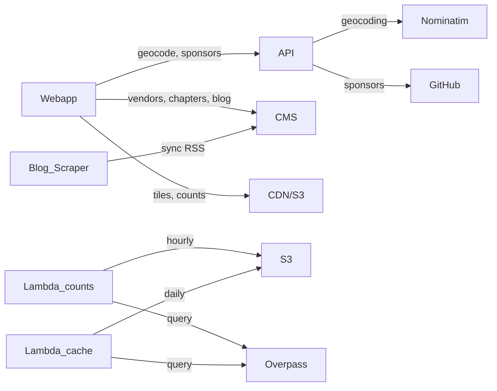
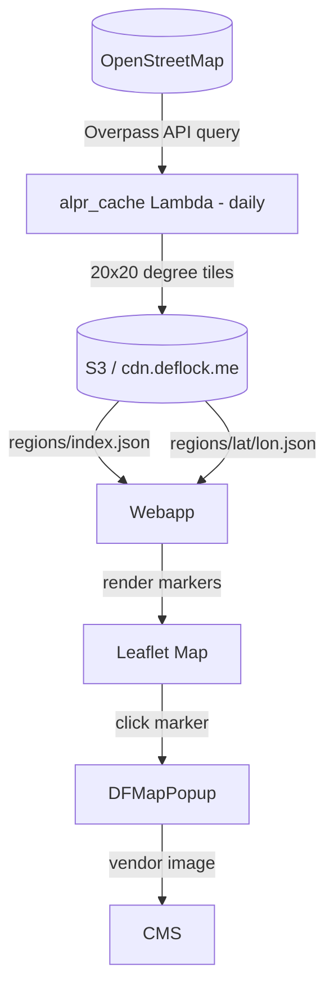

# DeFlock Architecture

## System Overview



DeFlock has four backend systems that the webapp consumes:

| System | URL | What it provides |
|--------|-----|------------------|
| **API** (Fastify) | `api.deflock.org` / `localhost:3000` | Geocoding proxy, GitHub sponsors |
| **CMS** (Directus) | `cms.deflock.me` | Vendor info, chapters, blog posts, win counts |
| **CDN** (S3) | `cdn.deflock.me` | Pre-computed ALPR tiles and counts |
| **Overpass API** | (external) | Raw ALPR data from OpenStreetMap |

The webapp auto-detects local development and routes API calls to `localhost:3000`. The CMS is always `cms.deflock.me` (no localhost mode).

---

## Feature-to-Service Map

Every webapp route and which backend services power it:

| Route | Page | API | CMS | CDN/S3 | Notes |
|-------|------|:---:|:---:|:------:|-------|
| `/` | Landing | | | `alpr-counts.json` | ALPR counter widget, win count |
| `/map` | Map | `geocode` | vendors (popups) | `regions/*.json` | Main feature — interactive ALPR map |
| `/groups` | Local Groups | | `chapters` | | Community group directory |
| `/identify` | Identify LPRs | | `lprVendors`, `nonLprVendors` | | Camera identification gallery |
| `/report` | Report Choose | | | | Static — choose reporting method |
| `/report/id` | Report via OSM | | `lprVendors` | | OSM tag selector for manual reporting |
| `/blog` | Blog | | `blog` | | Paginated blog posts |
| `/blog/:id` | Blog Post | | `blog/:id` | | Full blog post content (HTML) |
| `/donate` | Donate | `sponsors/github` | | | GitHub sponsors list |
| `/what-is-an-alpr` | Learn | | | | Static + embedded YouTube |
| `/about` | About | | | | Static |
| `/app` | Mobile App | | | | Static — app download links |
| `/app/docs` | App User Guide | | | | Static |
| `/foia` | FOIA Guide | | | | Static |
| `/council` | Council | | | | Static |
| `/contact` | Contact | | | | Static |
| `/press` | Press | | | | Static |
| `/store` | Store | | | | Static |
| `/terms` | Terms | | | | Static |
| `/privacy` | Privacy | | | | Static |

---

## Data Flow: How ALPRs Get on the Map



1. **alpr_cache** Lambda runs daily, queries Overpass for all ALPR nodes globally
2. Nodes are segmented into 20-degree geographic tiles with whitelisted tags
3. Tiles are uploaded to S3 as `regions/{lat}/{lon}.json` with an `index.json` manifest
4. The webapp's **tiles store** fetches visible tiles based on the map viewport
5. Markers are clustered using Leaflet.MarkerCluster (auto-enabled below zoom 12)
6. Clicking a marker shows vendor info from the CMS vendor store

---

## API Endpoints

The Fastify API (`api/server.ts`) exposes:

| Method | Endpoint | Description | Upstream |
|--------|----------|-------------|----------|
| `GET` | `/geocode?query=...` | Location search | Nominatim (24h disk cache) |
| `GET` | `/sponsors/github?username=...` | GitHub sponsors list | GitHub GraphQL API |
| `HEAD` | `/healthcheck` | Health check | — |

**CORS**: Allows `localhost:5173`, `deflock.org`, `www.deflock.org`, `*.deflock.pages.dev`

**Env vars**: `GITHUB_TOKEN` (for sponsors endpoint)

---

## CMS Collections

Directus at `cms.deflock.me` serves these collections:

| Collection | Endpoint | Used by |
|------------|----------|---------|
| `chapters` | `/items/chapters` | Groups page — local activist groups |
| `lprVendors` | `/items/lprVendors` | Identify page, map popups, OSM tag selector |
| `nonLprVendors` | `/items/nonLprVendors` | Identify page — other surveillance devices |
| `blog` | `/items/blog` | Blog listing and individual posts |
| `flockWins` | `/items/flockWins` | Landing page counter — cities rejecting ALPRs |

---

## Serverless Functions

| Function | Schedule | What it does |
|----------|----------|--------------|
| **alpr_cache** | Daily | Queries Overpass for all ALPRs, tiles them into 20-degree segments, uploads to S3 |
| **alpr_counts** | Hourly | Counts US ALPRs via Overpass, fetches wins from CMS, writes `alpr-counts.json` to S3 |
| **blog_scraper** | On trigger | Syncs RSS feed from haveibeenflocked.com into CMS blog collection |

---

## Webapp State Management (Pinia)

| Store | Purpose | Data Source |
|-------|---------|-------------|
| **tiles** | Caches ALPR tile data, tracks which tiles are loaded | CDN/S3 tiles |
| **vendorStore** | Caches LPR vendor and device info (lazy-loaded) | CMS |
| **global** | User geolocation state | Browser Geolocation API |

---

## Key User Flows

### Searching the Map
```
User types city in search bar
  → geocodeQuery() → localhost:3000/geocode (dev) or api.deflock.org/geocode (prod)
    → Nominatim returns lat/lon + GeoJSON boundary
      → Map pans to location, loads visible tiles from S3
        → ALPRs rendered as markers with clustering
```

### Reporting an ALPR
```
User clicks "+" on map → /report
  → Option A: Download DeFlock mobile app
  → Option B: /report/id (legacy OSM editor)
       → Select manufacturer from vendor store (CMS)
         → Copy OSM tags → paste into openstreetmap.org editor
```

### Reading Blog Posts
```
/blog → CMS /items/blog (paginated, 5 per page)
  → Click post → /blog/:id → CMS /items/blog/:id (full HTML content)
  → Posts with externalUrl link out to haveibeenflocked.com
```

---

## External Services

| Service | Purpose |
|---------|---------|
| **Overpass API** | Queries OpenStreetMap for ALPR nodes |
| **Nominatim** | Geocoding (proxied through the API) |
| **OpenStreetMap** | Source of all ALPR data; users report via OSM editor |
| **GitHub API** | Fetches sponsor list for donate page |
| **Wikimedia Commons** | ALPR images linked from OSM tags |
| **AWS S3** | Hosts pre-computed tiles and counts at `cdn.deflock.me` |
| **AWS Lambda** | Runs data processing (cache, counts, blog scraper) |
| **Cloudflare** | DNS, CDN proxy, cache purging |
| **GitHub Actions** | CI/CD — API deploys on push to `master` |

---

## Local Development Notes

- **Webapp** (`npm run dev` in `webapp/`): Runs on port 5173
- **API** (`bun server.ts` in `api/`): Runs on port 3000; webapp auto-detects localhost and routes to it
- **CMS**: The webapp always hits `cms.deflock.me` (production) — there is no localhost CMS detection. Running CMS locally requires Docker + SQLite database setup and is not needed for frontend development
- **Validating local API**: Open browser DevTools Network tab, use the map search bar — requests should go to `localhost:3000/geocode`
